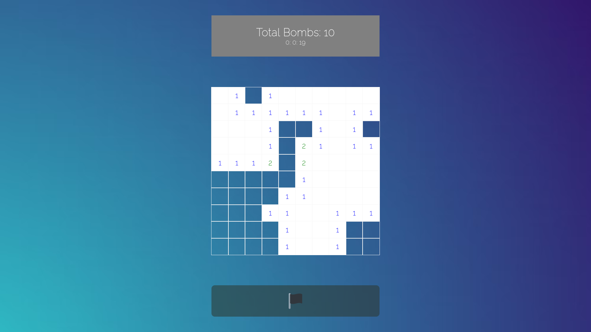

## Intro

Minesweeper is single-player logic-based computer game played on rectangular board whose object is to locate a predetermined number of randomly-placed "mines" in the shortest possible time by clicking on "safe" squares while avoiding the squares with mines. If the player clicks on a mine, the game ends. Otherwise, a number between 0 and 8 is displayed that identifies the total number of mines present in the eight neighboring squares. Therefore, finding a square containing "8" indicated that all eight adjacent squares contain mines, while if a zero (displayed as a blank) is uncovered, there are no mines in the surrounding squares. A square suspected of containing a mine may be marked with flag. 


## Game Logic

Using js to create cells and assign the x-y coordinate ,eg: id="2-4",etc.
Bomb set according to user choice of bombs, the bombs will be saved in array for checking safe and unsafe cells.


```html

 for(let i =0; i<10; i++) {
        let row = []
        for(let j =0; j<10; j++) {
            const div = document.createElement('div')
            const id = `${i}-${j}`
            row.push(id)
            div.setAttribute('id',id)
            div.onclick = setClick
            board.appendChild(div)
        }
    }
    setBomb()


```

Recursion is implemented,cells with that lacks bombs will keep on recursively being revealed until the condition comes across 
cells with neighbouring bombs , nearest neighbours will be assigned the total number of bomb contained within the range of 8 cells.

Main function which checks for bombs.
Mineslocation is an array with the map of bomb coordinates, bomb found within mineslocation will return 1 else 0 for an empty case.

```html


function checkTile(row,col) {
    if(row < 0 || row >= 10 || col < 0 || col >= 10)    return 0
    if(mineslocation.includes(`${row}-${col}`)) return 1

    return 0
}

```




